# 🔐 Azure AI Foundry Security & RBAC Best Practices

## 📋 Overview

This document outlines the security best practices and role-based access control (RBAC) configuration for your Azure AI Foundry project with WebApp, Container App, and Container API components.

## 🏗️ Security Architecture

```mermaid
graph TB
    subgraph "👥 Users & Identity"
        EndUsers[👤 End Users<br/>Web/Mobile Users]
        DevTeam[👨‍💻 Development Team<br/>Developers & DevOps]
        AdminTeam[🛡️ Admin Team<br/>Security & Operations]
    end

    subgraph "🌐 Application Layer"
        WebApp[🌍 Web Application<br/>aisearch-webapp]
        ContainerApp[🐳 Container App<br/>ca-aisearch-app]
        ContainerAPI[🔌 Container API<br/>ca-aisearch-api]
    end

    subgraph "🤖 AI Services Layer"
        OpenAI[🧠 OpenAI Service<br/>Deployed Models]
        GeneralAI[🔧 General AI Services<br/>Speech, Vision, etc.]
        CogSearch[🔍 Cognitive Search<br/>Vector & Semantic Search]
    end

    subgraph "💾 Data & Storage"
        KeyVault[🔑 Key Vault<br/>Secrets & Config]
        Storage[📦 Storage Account<br/>Documents & Models]
        Registry[📋 Container Registry<br/>App Images]
    end

    subgraph "📊 Monitoring"
        AppInsights[📈 Application Insights]
        LogAnalytics[📝 Log Analytics]
    end

    %% User Access Patterns
    EndUsers -->|HTTPS/OAuth| WebApp
    EndUsers -->|HTTPS/API Keys| ContainerApp
    DevTeam -->|Azure AD| WebApp
    DevTeam -->|Azure AD| ContainerApp
    DevTeam -->|Azure AD| ContainerAPI
    AdminTeam -->|Privileged Access| KeyVault

    %% Application to Services (via Managed Identity)
    WebApp -.->|Managed Identity| OpenAI
    WebApp -.->|Managed Identity| GeneralAI
    WebApp -.->|Managed Identity| CogSearch
    WebApp -.->|Managed Identity| KeyVault
    WebApp -.->|Managed Identity| Storage

    ContainerApp -.->|Managed Identity| OpenAI
    ContainerApp -.->|Managed Identity| GeneralAI
    ContainerApp -.->|Managed Identity| CogSearch
    ContainerApp -.->|Managed Identity| KeyVault
    ContainerApp -.->|Managed Identity| Storage

    ContainerAPI -.->|Managed Identity| OpenAI
    ContainerAPI -.->|Managed Identity| GeneralAI
    ContainerAPI -.->|Managed Identity| CogSearch
    ContainerAPI -.->|Managed Identity| KeyVault
    ContainerAPI -.->|Managed Identity| Storage

    %% Monitoring
    WebApp --> AppInsights
    ContainerApp --> AppInsights
    ContainerAPI --> AppInsights
    AppInsights --> LogAnalytics
```



## 🎯 Identity & Access Management Strategy

### **1. 🆔 Managed Identities (System-Assigned)**

Each application service should use **System-Assigned Managed Identity** for service-to-service authentication:

```bash
# Enable managed identity for Web App
az webapp identity assign \
  --name aisearch-webapp \
  --resource-group rg-ai-search01

# Enable managed identity for Container App
az containerapp identity assign \
  --name ca-aisearch-app \
  --resource-group rg-ai-search01 \
  --system-assigned

# Enable managed identity for Container API
az containerapp identity assign \
  --name ca-aisearch-api \
  --resource-group rg-ai-search01 \
  --system-assigned
```

### **2. 👥 User Authentication Patterns**

#### **End Users (External)**
- **Authentication**: Azure AD B2C or OAuth2/OpenID Connect
- **Access**: Through application endpoints only
- **Security**: Rate limiting, API keys, JWT tokens

#### **Development Team**
- **Authentication**: Azure AD (corporate identity)
- **Access**: Development resources and non-production environments
- **Security**: Conditional access policies, MFA required

#### **Admin Team**
- **Authentication**: Azure AD with PIM (Privileged Identity Management)
- **Access**: Production resources, Key Vault, security configurations
- **Security**: Just-in-time access, approval workflows

## 🔑 RBAC Configuration by Service

### **🧠 OpenAI Service Permissions**

```bash
# For Applications (via Managed Identity)
OPENAI_SCOPE="/subscriptions/${SUBSCRIPTION_ID}/resourceGroups/rg-ai-search01/providers/Microsoft.CognitiveServices/accounts/openai-aisearch01"

# Web App
az role assignment create \
  --role "Cognitive Services OpenAI User" \
  --assignee $(az webapp identity show --name aisearch-webapp --resource-group rg-ai-search01 --query principalId -o tsv) \
  --scope $OPENAI_SCOPE

# Container App
az role assignment create \
  --role "Cognitive Services OpenAI User" \
  --assignee $(az containerapp identity show --name ca-aisearch-app --resource-group rg-ai-search01 --query principalId -o tsv) \
  --scope $OPENAI_SCOPE

# Container API
az role assignment create \
  --role "Cognitive Services OpenAI User" \
  --assignee $(az containerapp identity show --name ca-aisearch-api --resource-group rg-ai-search01 --query principalId -o tsv) \
  --scope $OPENAI_SCOPE

# For Developers (Development Only)
az role assignment create \
  --role "Cognitive Services OpenAI User" \
  --assignee developer@company.com \
  --scope $OPENAI_SCOPE

# For Admins (Model Management)
az role assignment create \
  --role "Cognitive Services OpenAI Contributor" \
  --assignee admin@company.com \
  --scope $OPENAI_SCOPE
```

**📋 OpenAI Roles Explained:**
- **Cognitive Services OpenAI User**: Can use deployed models, make API calls
- **Cognitive Services OpenAI Contributor**: Can deploy/manage models, plus User permissions

### **🔧 General AI Services Permissions**

```bash
# For Applications (Speech, Vision, Translation)
GENERAL_AI_SCOPE="/subscriptions/${SUBSCRIPTION_ID}/resourceGroups/rg-ai-search01/providers/Microsoft.CognitiveServices/accounts/aiserv-ai-search01"

# Applications - Runtime access
for app in "aisearch-webapp" "ca-aisearch-app" "ca-aisearch-api"; do
  PRINCIPAL_ID=$(az webapp identity show --name $app --resource-group rg-ai-search01 --query principalId -o tsv 2>/dev/null || \
                az containerapp identity show --name $app --resource-group rg-ai-search01 --query principalId -o tsv)

  az role assignment create \
    --role "Cognitive Services User" \
    --assignee $PRINCIPAL_ID \
    --scope $GENERAL_AI_SCOPE
done

# Developers - Testing access
az role assignment create \
  --role "Cognitive Services User" \
  --assignee developer@company.com \
  --scope $GENERAL_AI_SCOPE
```

### **🔍 Cognitive Search Permissions**

```bash
SEARCH_SCOPE="/subscriptions/${SUBSCRIPTION_ID}/resourceGroups/rg-ai-search01/providers/Microsoft.Search/searchServices/cog-ai-search01"

# Applications - Query and index access
for app in "aisearch-webapp" "ca-aisearch-app" "ca-aisearch-api"; do
  PRINCIPAL_ID=$(az webapp identity show --name $app --resource-group rg-ai-search01 --query principalId -o tsv 2>/dev/null || \
                az containerapp identity show --name $app --resource-group rg-ai-search01 --query principalId -o tsv)

  # Read access to search indexes
  az role assignment create \
    --role "Search Index Data Reader" \
    --assignee $PRINCIPAL_ID \
    --scope $SEARCH_SCOPE

  # Write access for document indexing (if needed)
  az role assignment create \
    --role "Search Index Data Contributor" \
    --assignee $PRINCIPAL_ID \
    --scope $SEARCH_SCOPE
done

# Developers - Full development access
az role assignment create \
  --role "Search Service Contributor" \
  --assignee developer@company.com \
  --scope $SEARCH_SCOPE

# Admins - Full management
az role assignment create \
  --role "Search Service Contributor" \
  --assignee admin@company.com \
  --scope $SEARCH_SCOPE
```

**📋 Search Roles Explained:**
- **Search Index Data Reader**: Query indexes, read documents
- **Search Index Data Contributor**: Add/update/delete documents in indexes
- **Search Service Contributor**: Manage indexes, data sources, skillsets

### **🔑 Key Vault Permissions**

```bash
KEYVAULT_SCOPE="/subscriptions/${SUBSCRIPTION_ID}/resourceGroups/rg-ai-search01/providers/Microsoft.KeyVault/vaults/kvaisearch01"

# Applications - Read secrets only
for app in "aisearch-webapp" "ca-aisearch-app" "ca-aisearch-api"; do
  PRINCIPAL_ID=$(az webapp identity show --name $app --resource-group rg-ai-search01 --query principalId -o tsv 2>/dev/null || \
                az containerapp identity show --name $app --resource-group rg-ai-search01 --query principalId -o tsv)

  az role assignment create \
    --role "Key Vault Secrets User" \
    --assignee $PRINCIPAL_ID \
    --scope $KEYVAULT_SCOPE
done

# Developers - Read secrets (dev environment only)
az role assignment create \
  --role "Key Vault Secrets User" \
  --assignee developer@company.com \
  --scope $KEYVAULT_SCOPE

# Admins - Manage secrets
az role assignment create \
  --role "Key Vault Administrator" \
  --assignee admin@company.com \
  --scope $KEYVAULT_SCOPE

# Service Principal for CI/CD (if needed)
az role assignment create \
  --role "Key Vault Secrets Officer" \
  --assignee $CICD_SERVICE_PRINCIPAL_ID \
  --scope $KEYVAULT_SCOPE
```

### **📦 Storage Account Permissions**

```bash
STORAGE_SCOPE="/subscriptions/${SUBSCRIPTION_ID}/resourceGroups/rg-ai-search01/providers/Microsoft.Storage/storageAccounts/staisearch01"

# Applications - Read/write documents and model artifacts
for app in "aisearch-webapp" "ca-aisearch-app" "ca-aisearch-api"; do
  PRINCIPAL_ID=$(az webapp identity show --name $app --resource-group rg-ai-search01 --query principalId -o tsv 2>/dev/null || \
                az containerapp identity show --name $app --resource-group rg-ai-search01 --query principalId -o tsv)

  # Blob access for documents
  az role assignment create \
    --role "Storage Blob Data Contributor" \
    --assignee $PRINCIPAL_ID \
    --scope $STORAGE_SCOPE
done

# Developers - Development access
az role assignment create \
  --role "Storage Blob Data Contributor" \
  --assignee developer@company.com \
  --scope $STORAGE_SCOPE

# Admins - Full management
az role assignment create \
  --role "Storage Account Contributor" \
  --assignee admin@company.com \
  --scope $STORAGE_SCOPE
```

### **📋 Container Registry Permissions**

```bash
REGISTRY_SCOPE="/subscriptions/${SUBSCRIPTION_ID}/resourceGroups/rg-ai-search01/providers/Microsoft.ContainerRegistry/registries/craisearch01"

# Container Apps - Pull images
for app in "ca-aisearch-app" "ca-aisearch-api"; do
  PRINCIPAL_ID=$(az containerapp identity show --name $app --resource-group rg-ai-search01 --query principalId -o tsv)

  az role assignment create \
    --role "AcrPull" \
    --assignee $PRINCIPAL_ID \
    --scope $REGISTRY_SCOPE
done

# Developers - Push/pull images
az role assignment create \
  --role "AcrPush" \
  --assignee developer@company.com \
  --scope $REGISTRY_SCOPE

# CI/CD Service Principal - Push images
az role assignment create \
  --role "AcrPush" \
  --assignee $CICD_SERVICE_PRINCIPAL_ID \
  --scope $REGISTRY_SCOPE
```

## 👥 User Role Assignments by Persona

### **🏠 End Users (External)**

**Access Pattern**: Through application frontends only
- **Authentication**: Azure AD B2C, OAuth2, or API keys
- **Permissions**: No direct Azure resource access
- **Security Controls**:
  ```bash
  # Applications handle user auth - no direct Azure permissions needed
  # Security implemented at application level:
  # - Rate limiting
  # - Input validation
  # - Session management
  # - API key rotation
  ```

### **👨‍💻 Development Team**

**Recommended Roles per Developer**:
```bash
DEVELOPER_EMAIL="developer@company.com"
RG_SCOPE="/subscriptions/${SUBSCRIPTION_ID}/resourceGroups/rg-ai-search01"

# Resource Group level - Development access
az role assignment create \
  --role "Contributor" \
  --assignee $DEVELOPER_EMAIL \
  --scope $RG_SCOPE

# Specific AI service access (see individual service sections above)
# Key Vault - Read secrets for development
# OpenAI - Use models for testing
# Search - Full development access
# Storage - Read/write development data
```

### **🛡️ Admin Team**

**Recommended Roles per Admin**:
```bash
ADMIN_EMAIL="admin@company.com"
SUBSCRIPTION_SCOPE="/subscriptions/${SUBSCRIPTION_ID}"
RG_SCOPE="/subscriptions/${SUBSCRIPTION_ID}/resourceGroups/rg-ai-search01"

# Subscription level - Full management
az role assignment create \
  --role "Owner" \
  --assignee $ADMIN_EMAIL \
  --scope $RG_SCOPE

# Consider using PIM (Privileged Identity Management) for just-in-time access
az rest --method POST \
  --url "https://graph.microsoft.com/v1.0/privilegedAccess/azureResources/roleAssignmentRequests" \
  --body '{
    "roleDefinitionId": "owner-role-id",
    "resourceId": "'$RG_SCOPE'",
    "subjectId": "'$ADMIN_OBJECT_ID'",
    "type": "AdminAdd",
    "assignmentState": "Eligible"
  }'
```

### **🤖 CI/CD Service Principal**

```bash
# Create service principal for automated deployments
CICD_SP=$(az ad sp create-for-rbac --name "sp-aisearch-cicd" --role Contributor --scopes $RG_SCOPE)
CICD_SP_ID=$(echo $CICD_SP | jq -r '.appId')

# Additional permissions for container registry
az role assignment create \
  --role "AcrPush" \
  --assignee $CICD_SP_ID \
  --scope $REGISTRY_SCOPE

# Key Vault permissions for secret management
az role assignment create \
  --role "Key Vault Secrets Officer" \
  --assignee $CICD_SP_ID \
  --scope $KEYVAULT_SCOPE
```

## 🛡️ Security Best Practices

### **1. 🔐 Authentication & Authorization**

#### **Applications (Managed Identity)**
```python
# In your application code - use DefaultAzureCredential
from azure.identity import DefaultAzureCredential
from azure.keyvault.secrets import SecretClient

# This will automatically use managed identity in Azure
credential = DefaultAzureCredential()
client = SecretClient(
    vault_url="https://kvaisearch01.vault.azure.net/",
    credential=credential
)
```

#### **Users (Azure AD Integration)**
```python
# For web applications - integrate with Azure AD
from azure.identity import InteractiveBrowserCredential
from msal import ConfidentialClientApplication

# Use MSAL for user authentication
app = ConfidentialClientApplication(
    client_id="your-app-client-id",
    client_credential="your-app-secret",
    authority="https://login.microsoftonline.com/your-tenant-id"
)
```

### **2. 🌐 Network Security**

#### **Private Endpoints (Production)**
```bash
# Create private endpoints for sensitive services
az network private-endpoint create \
  --name pe-keyvault \
  --resource-group rg-ai-search01 \
  --vnet-name vnet-aisearch \
  --subnet subnet-private \
  --private-connection-resource-id $KEYVAULT_SCOPE \
  --connection-name keyvault-connection \
  --group-id vault

# Disable public access
az keyvault update \
  --name kvaisearch01 \
  --resource-group rg-ai-search01 \
  --public-network-access Disabled
```

#### **Application Gateway + WAF**
```bash
# Create Application Gateway with Web Application Firewall
az network application-gateway create \
  --name ag-aisearch \
  --resource-group rg-ai-search01 \
  --capacity 2 \
  --sku WAF_v2 \
  --vnet-name vnet-aisearch \
  --subnet subnet-appgw \
  --public-ip-address pip-appgw \
  --frontend-port 443 \
  --http-settings-cookie-based-affinity Disabled \
  --http-settings-port 80 \
  --http-settings-protocol Http
```

### **3. 📊 Monitoring & Alerting**

#### **Security Monitoring**
```bash
# Create security alerts
az monitor activity-log alert create \
  --name "High-Privilege-Access" \
  --resource-group rg-ai-search01 \
  --condition category=Administrative and operationName=Microsoft.Authorization/roleAssignments/write \
  --action-group ag-security-team

# Monitor Key Vault access
az monitor metrics alert create \
  --name "Unusual-KeyVault-Access" \
  --resource rg-ai-search01 \
  --condition "Total ServiceApiHit > 1000" \
  --window-size 5m \
  --evaluation-frequency 1m
```

#### **Application Monitoring**
```python
# In your applications - add security logging
import logging
from azure.monitor.opentelemetry import configure_azure_monitor

# Configure Application Insights
configure_azure_monitor(
    connection_string="your-app-insights-connection-string"
)

# Log security events
def log_security_event(event_type, user_id, details):
    logging.warning(f"SECURITY: {event_type} - User: {user_id} - {details}")
```

### **4. 🔄 Secret Rotation**

#### **Automated Key Rotation**
```bash
# Set up automatic secret rotation for OpenAI keys
az keyvault secret set \
  --vault-name kvaisearch01 \
  --name "ai-services-key" \
  --value "$(az cognitiveservices account keys list --name openai-aisearch01 --resource-group rg-ai-search01 --query key1 -o tsv)" \
  --expires "$(date -d '+90 days' -u +%Y-%m-%dT%H:%M:%SZ)"

# Create Logic App for automated rotation
az logic workflow create \
  --resource-group rg-ai-search01 \
  --name lapp-key-rotation \
  --definition @key-rotation-workflow.json
```

## ⚠️ Security Checklist

### **🔒 Pre-Production**
- [ ] All applications use managed identity
- [ ] No hardcoded keys or secrets in code
- [ ] All secrets stored in Key Vault
- [ ] Least privilege access implemented
- [ ] Development team has limited production access
- [ ] Service-to-service communication uses managed identity

### **🚀 Production**
- [ ] Private endpoints enabled for Key Vault and Storage
- [ ] Public access disabled where possible
- [ ] Web Application Firewall deployed
- [ ] Security monitoring and alerting configured
- [ ] Admin access uses PIM (just-in-time)
- [ ] Regular access reviews scheduled
- [ ] Automated secret rotation enabled
- [ ] Network security groups configured
- [ ] DDoS protection enabled
- [ ] Backup and disaster recovery tested

### **📈 Ongoing**
- [ ] Monthly access reviews
- [ ] Quarterly security assessments
- [ ] Key rotation every 90 days
- [ ] Security training for team
- [ ] Incident response plan tested
- [ ] Compliance audit preparation

## 🚨 Emergency Procedures

### **Compromised Key Response**
```bash
# 1. Immediately rotate the compromised key
az cognitiveservices account keys regenerate \
  --name openai-aisearch01 \
  --resource-group rg-ai-search01 \
  --key-name key1

# 2. Update Key Vault with new key
NEW_KEY=$(az cognitiveservices account keys list --name openai-aisearch01 --resource-group rg-ai-search01 --query key1 -o tsv)
az keyvault secret set \
  --vault-name kvaisearch01 \
  --name "ai-services-key" \
  --value "$NEW_KEY"

# 3. Restart applications to pick up new key
az webapp restart --name aisearch-webapp --resource-group rg-ai-search01
az containerapp revision restart --name ca-aisearch-app --resource-group rg-ai-search01
```

### **Unauthorized Access Response**
```bash
# 1. Review recent access
az monitor activity-log list \
  --resource-group rg-ai-search01 \
  --start-time 2025-01-01T00:00:00Z \
  --caller suspicious@domain.com

# 2. Revoke access immediately
az role assignment delete \
  --assignee suspicious@domain.com \
  --scope $RG_SCOPE

# 3. Enable additional monitoring
az monitor diagnostic-settings create \
  --name "enhanced-security-logging" \
  --resource $KEYVAULT_SCOPE \
  --logs '[{"category":"AuditEvent","enabled":true}]' \
  --workspace $LOG_ANALYTICS_WORKSPACE_ID
```

---

## 📞 Support & Resources

- **Azure Security Center**: Monitor security posture
- **Azure Sentinel**: Advanced threat detection
- **Microsoft Defender for Cloud**: Cloud security management
- **Azure AD PIM**: Privileged identity management
- **Key Vault**: Centralized secret management

Remember: Security is a continuous process, not a one-time setup. Regular reviews and updates are essential for maintaining a secure environment.
