# 🚀 Azure AI Foundry Project

> A comprehensive, production-ready Azure AI infrastructure deployment solution with dual AI services architecture for optimal performance and cost efficiency.

[](https://azure.microsoft.com/)
[](https://python.org/)
[](https://openai.com/)

## 📋 Table of Contents

- [Overview](#-overview)
- [Architecture](#-architecture)
- [Features](#-features)
- [Prerequisites](#-prerequisites)
- [Quick Start](#-quick-start)
- [Configuration](#-configuration)
- [Usage](#-usage)
- [Architecture Deep Dive](#-architecture-deep-dive)
- [Security](#-security)
- [Troubleshooting](#-troubleshooting)
- [Contributing](#-contributing)

## 🎯 Overview

This project automates the creation of a complete Azure AI Foundry environment with:

- **Dual AI Services Architecture**: Separate OpenAI and General AI services for optimized performance
- **Complete Infrastructure**: All supporting services including search, storage, monitoring, and security
- **Production Ready**: Enterprise-grade configuration with proper security and monitoring
- **Idempotent Deployment**: Safe to run multiple times, only creates missing resources
- **Centralized Configuration**: All settings stored securely in Azure Key Vault

## 🏗️ Architecture

```mermaid
graph TB
    %% User and External
    User[👤 User/Application]

    %% Core AI Services
    subgraph "🧠 AI Services Layer"
        OpenAI[🤖 OpenAI Service<br/>openai-aisearch01<br/>• GPT Models<br/>• Embeddings<br/>• DALL-E<br/>• Whisper<br/>• TTS]
        GeneralAI[🔧 General AI Services<br/>aiserv-ai-search01<br/>• Speech-to-Text<br/>• Text-to-Speech<br/>• Translator<br/>• Computer Vision<br/>• Form Recognizer]
    end

    %% Search and Knowledge
    subgraph "🔍 Knowledge & Search Layer"
        CogSearch[🔎 Cognitive Search<br/>cog-ai-search01<br/>• Vector Search<br/>• Semantic Search<br/>• Document Indexing]

        subgraph "📊 ML & AI Foundry"
            MLWorkspace[🧪 ML Workspace<br/>ml-ai-search01<br/>• Model Training<br/>• Experimentation<br/>• AI Foundry Projects]
        end
    end

    %% Application Layer
    subgraph "🌐 Application Layer"
        WebApp[🌍 Web Application<br/>aisearch-webapp<br/>• Python Flask/FastAPI<br/>• REST API<br/>• OpenAPI Spec]
        AppService[⚙️ App Service Plan<br/>asp-aisearch01<br/>• Linux Container<br/>• Auto-scaling]

        subgraph "📦 Container Apps"
            ContainerApp[🐳 Container App<br/>ca-aisearch-app<br/>• Serverless Containers<br/>• Auto-scaling<br/>• Event-driven]
            ContainerEnv[🌍 Container Environment<br/>cae-aisearch01<br/>• Shared Environment<br/>• Networking<br/>• Monitoring]
        end
    end

    %% Storage and Data
    subgraph "💾 Storage & Data Layer"
        Storage[🗄️ Storage Account<br/>staisearch01<br/>• Blob Storage<br/>• Document Storage<br/>• Model Artifacts]
        ContainerReg[📦 Container Registry<br/>craisearch01<br/>• Docker Images<br/>• Application Containers]
    end

    %% Configuration and Security
    subgraph "🔐 Security & Configuration"
        KeyVault[🔑 Key Vault<br/>kvaisearch01<br/>• API Keys<br/>• Endpoints<br/>• Secrets<br/>• Configuration]
        AppConfig[⚙️ App Configuration<br/>ac-ai-search01<br/>• Feature Flags<br/>• Settings<br/>• Environment Config]
    end

    %% Monitoring and Logging
    subgraph "📈 Monitoring & Observability"
        AppInsights[📊 Application Insights<br/>ai-ai-search01<br/>• Performance Monitoring<br/>• Error Tracking<br/>• Usage Analytics]
        LogWorkspace[📝 Log Analytics<br/>log-ai-search01<br/>• Centralized Logging<br/>• Query & Analysis<br/>• Alerting]
    end

    %% Resource Management
    subgraph "🏢 Resource Management"
        ResourceGroup[🏗️ Resource Group<br/>rg-ai-search01<br/>East US 2]
    end

    %% Connections
    User --> WebApp
    User --> ContainerApp
    WebApp --> AppService
    ContainerApp --> ContainerEnv
    WebApp --> OpenAI
    WebApp --> GeneralAI
    WebApp --> CogSearch
    WebApp --> KeyVault
    WebApp --> AppConfig

    ContainerApp --> OpenAI
    ContainerApp --> GeneralAI
    ContainerApp --> CogSearch
    ContainerApp --> KeyVault
    ContainerApp --> AppConfig

    OpenAI --> Storage
    CogSearch --> Storage
    MLWorkspace --> Storage
    MLWorkspace --> OpenAI
    MLWorkspace --> CogSearch

    WebApp --> AppInsights
    ContainerApp --> AppInsights
    AppInsights --> LogWorkspace
    ContainerEnv --> LogWorkspace

    ContainerReg --> AppService
    ContainerReg --> ContainerApp

    %% All resources in resource group
    ResourceGroup -.-> OpenAI
    ResourceGroup -.-> GeneralAI
    ResourceGroup -.-> CogSearch
    ResourceGroup -.-> MLWorkspace
    ResourceGroup -.-> ContainerApp
    ResourceGroup -.-> ContainerEnv
    ResourceGroup -.-> AppService
    ResourceGroup -.-> Storage
    ResourceGroup -.-> ContainerReg
    ResourceGroup -.-> KeyVault
    ResourceGroup -.-> AppConfig
    ResourceGroup -.-> AppInsights
    ResourceGroup -.-> LogWorkspace

    %% Styling
    classDef aiServices fill:#e1f5fe,stroke:#01579b,stroke-width:3px,color:#000
    classDef storage fill:#f3e5f5,stroke:#4a148c,stroke-width:2px,color:#000
    classDef security fill:#e8f5e8,stroke:#1b5e20,stroke-width:2px,color:#000
    classDef monitoring fill:#fff3e0,stroke:#e65100,stroke-width:2px,color:#000
    classDef application fill:#fce4ec,stroke:#880e4f,stroke-width:2px,color:#000
    classDef management fill:#f1f8e9,stroke:#33691e,stroke-width:2px,color:#000

    class OpenAI,GeneralAI,CogSearch,MLWorkspace aiServices
    class Storage,ContainerReg storage
    class KeyVault,AppConfig security
    class AppInsights,LogWorkspace monitoring
    class WebApp,AppService,ContainerApp,ContainerEnv application
    class ResourceGroup management
```



## ✨ Features

### 🤖 **Comprehensive AI Capabilities**
- **OpenAI Service**: GPT-4o-mini, embeddings, DALL-E 3, Whisper, TTS
- **General AI Services**: Speech, translation, computer vision, form recognition
- **Cognitive Search**: Vector search, semantic search, RAG capabilities

### 🏗️ **Production Infrastructure**
- **Flexible Hosting**: App Service and Container Apps for different deployment needs
- **Serverless Containers**: Auto-scaling container apps for event-driven workloads
- **Secure Storage**: Blob storage for documents and models
- **Container Support**: Azure Container Registry for deployments

### 🔐 **Enterprise Security**
- **Centralized Secrets**: All configuration in Azure Key Vault
- **Managed Identity**: Secure service-to-service authentication
- **Network Security**: VNet integration ready

### 📊 **Monitoring & Observability**
- **Application Insights**: Performance and error monitoring
- **Log Analytics**: Centralized logging and alerting
- **Cost Management**: Resource tagging and optimization

### 🔄 **DevOps Ready**
- **Idempotent Deployment**: Safe to run multiple times
- **Infrastructure as Code**: Python-based deployment script
- **CI/CD Ready**: Easy integration with Azure DevOps or GitHub Actions

## 📋 Prerequisites

Before running the deployment script, ensure you have:

### Required Tools
- **Azure CLI** (latest version)
  ```bash
  # Install Azure CLI
  curl -sL https://aka.ms/InstallAzureCLIDeb | sudo bash
  ```
- **Python 3.8+** with pip
- **Git** (for cloning the repository)

### Azure Requirements
- **Azure Subscription** with appropriate permissions
- **Resource creation permissions** in your subscription
- **Quota availability** for:
  - Cognitive Services (OpenAI models)
  - App Services and Container Apps
  - Storage accounts

### Authentication
```bash
# Login to Azure
az login

# Verify your subscription
az account show
```

### Python Dependencies
```bash
# The script uses only standard library modules:
# - argparse, json, os, subprocess, sys, tempfile, time, typing
# No additional pip installations required!
```

## 🚀 Quick Start

### 1. **Clone the Repository**
```bash
git clone <repository-url>
cd azure-ai-foundry-project
```

### 2. **Set Up Environment**
```bash
# Copy the environment template
cp .env.template .env

# Edit configuration (optional - defaults work for most cases)
nano .env
```

### 3. **Deploy Infrastructure**
```bash
# Dry run to see what will be created
python create_ai_foundry_project.py --dry-run

# Deploy everything (creates BOTH App Service AND Container Apps)
python create_ai_foundry_project.py

# Deploy with verbose output
python create_ai_foundry_project.py --verbose
```

### 4. **Choose Your Deployment Target**
After infrastructure is ready, deploy your application to either:

```bash
# Option A: Deploy to App Service
az webapp deployment source config-zip \
  --resource-group rg-ai-search01 \
  --name aisearch-webapp \
  --src your-app.zip

# Option B: Deploy to Container Apps
az containerapp update \
  --resource-group rg-ai-search01 \
  --name ca-aisearch-app \
  --image your-registry/your-app:latest
```

### 5. **Verify Deployment**
```bash
# Check infrastructure
python check_variables.py

# Test your chosen endpoint
curl https://aisearch-webapp.azurewebsites.net/health
# OR
curl https://ca-aisearch-app.[region].azurecontainerapps.io/health
```

## ⚙️ Configuration

### **Minimal Configuration (.env)**
```bash
# Core Azure Settings
RESOURCE_GROUP=rg-ai-search01
LOCATION=eastus2
PROJECT_TAG=ai-search01

# AI Services
OPENAI_SERVICE_NAME=openai-aisearch01
AI_SERVICES_NAME=aiserv-ai-search01

# Core Services
COGNITIVE_SEARCH_NAME=cog-ai-search01
KEYVAULT_NAME=kvaisearch01

# Application Hosting
WEB_APP_NAME=aisearch-webapp
CONTAINER_APP_NAME=ca-aisearch-app

# Optional: Separate API Container
CONTAINER_APP_API_NAME=ca-aisearch-api
```

### **Advanced Configuration**
All other settings have sensible defaults but can be customized:

```bash
# Supporting Infrastructure
STORAGE_ACCOUNT_NAME=staisearch01
CONTAINER_REGISTRY_NAME=craisearch01
APPLICATION_INSIGHTS_NAME=ai-ai-search01
LOG_WORKSPACE_NAME=log-ai-search01
ML_WORKSPACE_NAME=ml-ai-search01

# Container Apps Environment
CONTAINER_APP_ENV_NAME=cae-aisearch01

# OpenAI Models (automatically deployed)
DEFAULT_OPENAI_MODELS=gpt-4o-mini,text-embedding-ada-002,whisper,tts-1
AZURE_OPENAI_API_VERSION=2024-02-01

# Deployment Strategy Options:
# 1. Either/Or: Deploy to App Service OR Container Apps
# 2. Microservices: Set CONTAINER_APP_API_NAME for separate API
# 3. Full Stack: Use all three hosting options
```

### 🎮 Usage

### **Command Line Options**

```bash
# Basic deployment (creates all resources)
python create_ai_foundry_project.py

# See what would be created without making changes
python create_ai_foundry_project.py --dry-run

# Enable detailed logging and progress tracking
python create_ai_foundry_project.py --verbose

# Only update Key Vault configuration (skip resource creation)
python create_ai_foundry_project.py --config-only
```

### **Environment Variable Override**
```bash
# Use custom resource group
RESOURCE_GROUP=my-custom-rg python create_ai_foundry_project.py

# Deploy to different region
LOCATION=westus2 python create_ai_foundry_project.py

# Use custom project name
PROJECT_TAG=my-project python create_ai_foundry_project.py
```

### **Code Quality & Standards**
The script follows strict Python standards and will pass:
- ✅ **black** (code formatting)
- ✅ **isort** (import sorting)
- ✅ **flake8** (PEP 8 compliance)
- ✅ **mypy** (type checking)

```bash
# Validate code quality (optional)
black --check create_ai_foundry_project.py
isort --check-only create_ai_foundry_project.py
flake8 create_ai_foundry_project.py --max-line-length=79
mypy create_ai_foundry_project.py
```

### **Application Integration**

After deployment, your applications only need minimal configuration:

```bash
# In your application's .env
KEYVAULT_NAME=kvaisearch01
```

Then retrieve all configuration from Key Vault:

```python
from azure.keyvault.secrets import SecretClient
from azure.identity import DefaultAzureCredential

# Connect to Key Vault
credential = DefaultAzureCredential()
client = SecretClient(
    vault_url="https://kvaisearch01.vault.azure.net/",
    credential=credential
)

# Get configuration
openai_endpoint = client.get_secret("ai-services-endpoint").value
openai_key = client.get_secret("ai-services-key").value
search_endpoint = client.get_secret("cognitive-search-endpoint").value

# All available secrets:
secrets = [
    "ai-services-endpoint", "ai-services-key",
    "cognitive-search-endpoint", "cognitive-search-admin-key",
    "storage-account-name", "storage-account-key",
    "web-app-url", "container-app-url",
    "application-insights-connection-string",
    # ... and 25+ more configuration values
]
```

### **Container Deployment Examples**

After infrastructure is ready, deploy your application:

```bash
# Deploy to App Service
az webapp deployment source config-zip \
  --resource-group rg-ai-search01 \
  --name aisearch-webapp \
  --src your-app.zip

# Deploy to Container Apps
az containerapp update \
  --resource-group rg-ai-search01 \
  --name ca-aisearch-app \
  --image your-registry/your-app:latest

# Deploy separate API container (if CONTAINER_APP_API_NAME is set)
az containerapp update \
  --resource-group rg-ai-search01 \
  --name ca-aisearch-api \
  --image your-registry/your-api:latest
```

## 🔍 Architecture Deep Dive

### **Dual AI Services Strategy**

Our architecture uses two separate AI services for optimal performance:

#### **OpenAI Service** (`openai-aisearch01`)
- **Purpose**: Advanced AI capabilities
- **Models**: GPT-4o-mini, embeddings, DALL-E, Whisper, TTS
- **Use Cases**: Chat, content generation, image creation, transcription

#### **General AI Services** (`aiserv-ai-search01`)
- **Purpose**: Traditional cognitive services
- **Capabilities**: Speech, translation, computer vision, form recognition
- **Use Cases**: Document processing, multilingual support, media analysis

### **Data Flow**

1. **User Request** → Web Application or Container App
2. **Authentication** → Key Vault retrieves secrets
3. **AI Processing** → OpenAI or General AI services
4. **Search Enhancement** → Cognitive Search for RAG
5. **Storage** → Documents and results in Storage Account
6. **Monitoring** → Application Insights tracks performance

### **Deployment Options (Either/Or Strategy)**

The infrastructure provides **two hosting options** for the same application - choose the one that best fits your needs:

#### **🌐 App Service** (`aisearch-webapp`)
```
Endpoint: https://aisearch-webapp.azurewebsites.net
```
- **Traditional PaaS**: Easy deployment, built-in scaling
- **Always-On**: Consistent performance, staging slots
- **Use Cases**: Traditional web applications, REST APIs
- **Billing**: Fixed monthly cost based on plan

#### **🐳 Container Apps** (`ca-aisearch-app`)
```
Endpoint: https://ca-aisearch-app.[region].azurecontainerapps.io
```
- **Serverless Containers**: Pay-per-request, auto-scale to zero
- **Event-Driven**: Perfect for APIs, microservices, batch jobs
- **Modern**: KEDA-based autoscaling, Dapr integration
- **Billing**: Pay only when running (can be $0 when idle)

#### **🎯 Both Options Provide:**
- ✅ Same codebase and functionality
- ✅ Same AI services access (OpenAI, Search, etc.)
- ✅ Same Key Vault configuration
- ✅ Same monitoring and logging
- ✅ Same managed identity setup

#### **🚀 Deployment Process:**
1. **Infrastructure Script** creates all hosting options and AI services
2. **Idempotent Execution** - safe to run multiple times
3. **Key Vault Population** - all configuration automatically stored
4. **Choose Deployment Target** - deploy to your preferred platform
5. **Managed Identity** - automatic secure access to resources

### **📊 Resource Summary:**
The script creates **15+ Azure resources** in a single deployment:
- 2 AI Services (OpenAI + General)
- 3 Hosting Options (App Service + 2 Container Apps)
- 8 Supporting Services (Storage, Search, Key Vault, etc.)
- Complete monitoring and security setup

### **Security Architecture**

- **Zero Trust**: All services use managed identity where possible
- **Secret Management**: Centralized in Key Vault with rotation capabilities
- **Network Security**: VNet integration ready for production
- **Compliance**: Follows Azure Well-Architected Framework

## 🔐 Security

### **Key Management**
- All API keys stored in **Azure Key Vault**
- Automatic key rotation capabilities
- Managed Identity for service-to-service authentication

### **Network Security**
- **Private Endpoints** ready for VNet integration
- **NSG rules** for traffic restriction
- **Azure Firewall** integration supported

### **Compliance**
- **Resource tagging** for governance
- **Activity logging** for audit trails
- **RBAC** for granular access control

### **Best Practices**
```python
# Use managed identity instead of keys when possible
from azure.identity import DefaultAzureCredential

# Rotate secrets regularly
# Monitor Key Vault access logs
# Use least privilege access principles
```

## 🐛 Troubleshooting

### **Common Issues**

#### **Quota Limitations**
```bash
# Check OpenAI quota and available models
az cognitiveservices account list-skus --kind OpenAI --location eastus2

# Check current usage
az cognitiveservices account list-usage \
  --name openai-aisearch01 \
  --resource-group rg-ai-search01

# Request quota increase in Azure portal
```

#### **Permission Errors**
```bash
# Check current permissions
az role assignment list \
  --assignee $(az account show --query user.name -o tsv) \
  --scope /subscriptions/$(az account show --query id -o tsv)

# Required roles for deployment:
# - Contributor (for resource creation)
# - Key Vault Administrator (for secret management)
# - Cognitive Services Contributor (for AI services)
```

#### **Model Deployment Failures**
```bash
# Check available models in your region
az cognitiveservices account list-models \
  --name openai-aisearch01 \
  --resource-group rg-ai-search01

# Retry failed model deployments
python create_ai_foundry_project.py --verbose

# Deploy models individually if needed
az rest --method PUT \
  --url "https://management.azure.com/.../deployments/gpt-4o-mini" \
  --body @model-config.json
```

#### **Container App Issues**
```bash
# Check Container Apps extension
az extension show --name containerapp || az extension add --name containerapp

# Verify container app status
az containerapp show \
  --name ca-aisearch-app \
  --resource-group rg-ai-search01 \
  --query "properties.provisioningState"

# Check container app logs
az containerapp logs show \
  --name ca-aisearch-app \
  --resource-group rg-ai-search01
```

### **Verification Commands**

```bash
# Complete infrastructure check
python check_variables.py --verbose

# Test specific services
az cognitiveservices account show \
  --name openai-aisearch01 \
  --resource-group rg-ai-search01

# Verify Key Vault access
az keyvault secret list --vault-name kvaisearch01

# Test OpenAI endpoint
curl -H "Authorization: Bearer $(az account get-access-token --query accessToken -o tsv)" \
  https://openai-aisearch01.openai.azure.com/openai/deployments/gpt-4o-mini/chat/completions?api-version=2024-02-01
```

### **Script Debugging**

```bash
# Dry run to see what would be created
python create_ai_foundry_project.py --dry-run

# Verbose output for detailed logging
python create_ai_foundry_project.py --verbose

# Update only Key Vault configuration
python create_ai_foundry_project.py --config-only

# Validate script with Python tools
black --check create_ai_foundry_project.py
flake8 create_ai_foundry_project.py --max-line-length=79
mypy create_ai_foundry_project.py
```

## 🔄 CI/CD Integration

### **GitHub Actions Example**

```yaml
name: Deploy Azure AI Infrastructure

on:
  push:
    branches: [main]
  workflow_dispatch:

jobs:
  deploy:
    runs-on: ubuntu-latest
    steps:
    - uses: actions/checkout@v4

    - name: Login to Azure
      uses: azure/login@v1
      with:
        creds: ${{ secrets.AZURE_CREDENTIALS }}

    - name: Deploy Infrastructure
      run: |
        python create_ai_foundry_project.py --verbose
```

### **Azure DevOps Pipeline**

```yaml
trigger:
- main

pool:
  vmImage: 'ubuntu-latest'

steps:
- task: AzureCLI@2
  displayName: 'Deploy AI Infrastructure'
  inputs:
    azureSubscription: '$(azureServiceConnection)'
    scriptType: 'bash'
    scriptLocation: 'inlineScript'
    inlineScript: |
      python create_ai_foundry_project.py --verbose
```

## 📊 Cost Optimization

### **Estimated Monthly Costs**

| Service | SKU | Estimated Cost | Usage Notes |
|---------|-----|----------------|-------------|
| OpenAI Service | S0 | $20-500/month* | Pay-per-token usage |
| General AI Services | S0 | $10-100/month* | API call-based |
| Cognitive Search | Free | $0 | Up to 50MB storage |
| App Service | F1 | $0 | Free tier (limited) |
| Container Apps | Consumption | $0-50/month* | Pay-per-request |
| Storage Account | Standard LRS | $5-20/month | Based on storage usage |
| Key Vault | Standard | $3/month | + $0.03 per 10K operations |
| Application Insights | Basic | $0-10/month | 5GB free per month |
| Container Registry | Basic | $5/month | 10GB storage included |

*Depends on usage volume

### **Cost Optimization Strategies**

#### **Development/Testing:**
```bash
# Use minimal configuration
LOCATION=eastus2  # Often has lower costs
DEFAULT_OPENAI_MODELS=gpt-4o-mini  # Most cost-effective model

# Deploy to free tiers
python create_ai_foundry_project.py --verbose
```

#### **Production Optimization:**
```bash
# Set up cost alerts
az consumption budget create \
  --budget-name "AI-Project-Monthly" \
  --amount 200 \
  --time-grain Monthly \
  --category Cost

# Monitor OpenAI token usage
az monitor metrics alert create \
  --name "OpenAI-High-Usage" \
  --condition "Total TokensUsed > 1000000"

# Use Container Apps for variable workloads (pay-per-request)
# Use App Service for consistent traffic (predictable cost)
```

#### **Resource Right-Sizing:**
- **Start Small**: Begin with free/basic tiers
- **Monitor Usage**: Use Application Insights to track patterns
- **Scale Gradually**: Upgrade only when needed
- **Cleanup Unused**: Remove test deployments and unused models

### **Cost Monitoring Commands**

```bash
# Check current costs
az consumption usage list \
  --start-date 2025-01-01 \
  --end-date 2025-01-31

# Monitor specific resource group
az consumption usage list \
  --scope /subscriptions/.../resourceGroups/rg-ai-search01

# Export cost data
az costmanagement export create \
  --name "monthly-costs" \
  --definition-type Usage \
  --dataset-granularity Monthly
```

## 🤝 Contributing

We welcome contributions! Please see our [Contributing Guidelines](CONTRIBUTING.md) for details.

### **Development Setup**

```bash
# Clone and setup
git clone <repository-url>
cd azure-ai-foundry-project

# Create virtual environment
python -m venv venv
source venv/bin/activate  # or `venv\Scripts\activate` on Windows

# Install dependencies
pip install -r requirements.txt

# Run tests
python -m pytest tests/
```

### **Code Standards**

- **Black** for code formatting
- **Flake8** for linting
- **Type hints** for all functions
- **Docstrings** for all public methods

## 📄 License

This project is licensed under the MIT License - see the [LICENSE](LICENSE) file for details.

## 🙏 Acknowledgments

- **Microsoft Azure** for the comprehensive AI platform
- **OpenAI** for advanced AI capabilities
- **Azure AI Foundry** for the ML workspace integration

---

<div align="center">

**[⬆ Back to Top](#-azure-ai-foundry-project)**

Made with ❤️ for the Azure AI community

[](https://portal.azure.com/#create/Microsoft.Template)

</div>
