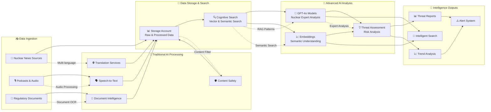
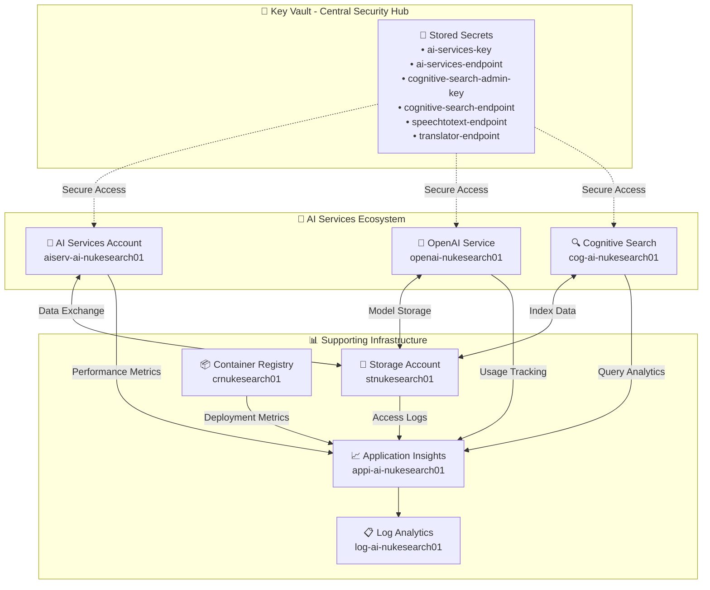

# Environment Setup Guide

## 📁 Repository Structure Overview

This document explains the Azure OpenAI repository structure and environment setup process.

### 🏗️ High-Level Architecture

```mermaid
graph TB
    subgraph "🔐 Security & Access Control"
        KV[🔑 Key Vault<br/>Central Secrets Store]
        RBAC[👥 RBAC Roles<br/>Access Management]
    end
    
    subgraph "🤖 AI Intelligence Services"
        AIS[🔧 AI Services<br/>Traditional AI<br/>• Speech/Vision<br/>• Translation<br/>• Content Safety]
        OAI[🧠 OpenAI Service<br/>Advanced LLMs<br/>• GPT-4o Models<br/>• Embeddings<br/>• Latest Features]
    end
    
    subgraph "📊 Data & Knowledge Platform"
        CS[🔍 Cognitive Search<br/>• Vector Search<br/>• Semantic Ranking<br/>• AI Enrichment]
        SA[💾 Storage Account<br/>• News Articles<br/>• Training Data<br/>• Model Artifacts]
    end
    
    subgraph "📦 Application & Monitoring"
        CR[📦 Container Registry<br/>Custom Models & Apps]
        AI_MON[📈 Application Insights<br/>Performance Monitoring]
        LA[📋 Log Analytics<br/>Centralized Logging]
    end
    
    subgraph "⚛️ Nuclear Intelligence Workflow"
        NEWS[📰 News Ingestion]
        ANALYSIS[🧬 Nuclear Analysis]
        THREATS[⚠️ Threat Assessment]
        SEARCH_INT[🎯 Intelligent Search]
    end
    
    %% Security Layer Connections
    KV -.->|Secrets| AIS
    KV -.->|Secrets| OAI
    KV -.->|Secrets| CS
    KV -.->|Secrets| SA
    RBAC -.->|Access| AIS
    RBAC -.->|Access| OAI
    RBAC -.->|Access| CS
    RBAC -.->|Access| SA
    
    %% AI Services Data Flow
    AIS -->|Traditional AI| CS
    OAI -->|Advanced LLMs| CS
    SA -->|Raw Data| CS
    SA <-->|Training Data| AIS
    SA <-->|Model Storage| OAI
    
    %% Application Layer Monitoring
    AI_MON <-- AIS
    AI_MON <-- OAI
    AI_MON <-- CS
    AI_MON <-- CR
    AI_MON --> LA
    
    %% Nuclear Intelligence Data Flow
    NEWS --> SA
    SA --> CS
    CS --> AIS
    CS --> OAI
    AIS --> ANALYSIS
    OAI --> ANALYSIS
    ANALYSIS --> THREATS
    CS --> SEARCH_INT
    OAI --> SEARCH_INT
    
    %% Monitoring Flow
    ANALYSIS --> AI_MON
    THREATS --> AI_MON
    SEARCH_INT --> AI_MON
```

### 📊 Data Processing Pipeline



### 🔐 Infrastructure & Security Overview



## 📂 Repository Structure

```
C:\AWSRepo\AzureOpenAI\
├── 📁 infra/                          # Infrastructure Deployment
│   ├── 📁 .venv/                      # ⚡ Isolated Python environment
│   ├── 📄 pyproject.toml              # Poetry dependencies config
│   ├── 📄 requirements.txt            # Runtime dependencies
│   ├── 📄 dev-requirements.txt        # Development dependencies
│   ├── 📄 .env.example                # Environment variables template
│   ├── 📄 create-ai-foundry-project.py # Main deployment script
│   ├── 📄 validate-ai-foundry-deployment.py # Validation script
│   ├── 📄 deployment-summary.py       # Post-deployment overview
│   └── 📁 templates/                  # ARM/Bicep templates
│       ├── 📄 main.bicep
│       └── 📄 parameters.json
│
├── 📁 projects/                       # AI Agents & Applications
│   ├── 📁 .venv/                      # ⚡ Isolated Python environment
│   ├── 📄 pyproject.toml              # AI/ML dependencies config
│   ├── 📄 requirements.txt            # OpenAI, Azure AI, FastAPI, etc.
│   ├── 📄 dev-requirements.txt        # Testing and dev tools
│   ├── 📁 nuclear-news-agent/         # 🤖 Nuclear industry news AI agent
│   │   ├── 📄 main.py                 # Agent entry point
│   │   ├── 📄 config.py               # Configuration management
│   │   ├── 📁 agents/                 # AI agent implementations
│   │   ├── 📁 tools/                  # Custom tools and utilities
│   │   └── 📁 templates/              # Prompt templates
│   ├── 📁 search-assistant/           # 🔍 AI-powered search assistant
│   │   ├── 📄 app.py                  # Web application
│   │   ├── 📄 search_engine.py        # Search logic
│   │   └── 📁 templates/              # Web templates
│   └── 📁 shared/                     # 🔧 Shared utilities
│       ├── 📄 azure_clients.py        # Azure service clients
│       ├── 📄 keyvault_helper.py      # Key Vault integration
│       └── 📄 monitoring.py           # Logging and monitoring
│
├── 📁 checks/                         # Quality Assurance & Security
│   ├── 📁 .venv/                      # ⚡ Isolated Python environment
│   ├── 📄 pyproject.toml              # QA tools dependencies
│   ├── 📄 requirements.txt            # Black, Flake8, MyPy, PyRIT, etc.
│   ├── 📄 run-quality-checks.py       # 🎨 Comprehensive code quality
│   ├── 📄 run-security-scan.py        # 🛡️ Security vulnerability scanning
│   ├── 📄 run-pyrit-tests.py          # 🤖 AI security testing (jailbreaks, etc.)
│   ├── 📄 coverage-report.py          # 📊 Test coverage analysis
│   ├── 📁 configs/                    # Tool configuration files
│   │   ├── 📄 .flake8                 # Linting configuration
│   │   ├── 📄 .banditrc               # Security scan configuration
│   │   ├── 📄 pyrit-config.yaml       # AI security test configuration
│   │   └── 📄 pytest.ini             # Testing configuration
│   └── 📁 reports/                    # 📈 Generated reports
│       ├── 📄 coverage.html           # Coverage report
│       ├── 📄 security-report.json    # Security scan results
│       └── 📄 pyrit-results.json      # AI security test results
│
├── 📁 scripts/                        # 🔧 Scripts & Utilities
│   ├── 📄 setup-environment.ps1       # 🚀 Main repository setup script
│   ├── 📄 create-gh.ps1               # 🐙 GitHub repository creation script
│   ├── 📄 .gh-config.env.template     # 📋 GitHub configuration template
│   ├── 📄 .gh-config.env              # ⚙️ GitHub configuration (gitignored)
│   ├── 📄 README-ENV-SETUP.md         # 📚 This documentation file
│   ├── 📁 azure/                      # ☁️ Azure CLI automation scripts
│   │   ├── 📄 deploy-openai.ps1       # Deploy OpenAI resources
│   │   ├── 📄 setup-keyvault.ps1      # Configure Key Vault
│   │   ├── 📄 monitor-costs.ps1       # Cost monitoring and alerts
│   │   └── 📄 backup-configs.ps1      # Backup configurations
│   ├── 📁 python/                     # 🐍 Python utility scripts
│   │   ├── 📄 test-connections.py     # Test Azure service connections
│   │   ├── 📄 migrate-secrets.py      # Migrate secrets between Key Vaults
│   │   ├── 📄 benchmark-models.py     # AI model performance testing
│   │   └── 📄 data-export.py          # Export data for analysis
│   └── 📁 maintenance/                # 🔧 System maintenance scripts
│       ├── 📄 cleanup-resources.py    # Clean up unused Azure resources
│       ├── 📄 rotate-keys.py          # Rotate API keys and secrets
│       └── 📄 health-check.py         # System health monitoring
│
├── 📁 docs/                           # 📖 Documentation
│   ├── 📄 README.md                   # Main project documentation
│   ├── 📄 SETUP.md                    # Detailed setup instructions
│   ├── 📄 ARCHITECTURE.md             # System architecture overview
│   ├── 📄 API.md                      # API documentation
│   └── 📁 examples/                   # 💡 Code examples
│       ├── 📄 basic-chat.py           # Simple OpenAI chat example
│       ├── 📄 rag-search.py           # RAG with Cognitive Search
│       └── 📄 batch-processing.py     # Batch AI processing
│
├── 📁 .github/                        # 🔄 CI/CD Workflows
│   ├── 📁 workflows/
│   │   ├── 📄 infra-ci.yml            # Infrastructure CI/CD
│   │   ├── 📄 projects-ci.yml         # Projects CI/CD
│   │   └── 📄 security-scan.yml       # Security scanning workflow
│   └── 📄 dependabot.yml              # Dependency updates
│
├── 📄 .gitignore                      # Git ignore patterns
├── 📄 .gitattributes                  # Git file attributes
├── 📄 README.md                       # Repository overview
├── 📄 CONTRIBUTING.md                 # Contribution guidelines
├── 📄 LICENSE                         # Project license
└── 📄 Makefile                        # Build automation commands
```

## 🚀 Quick Start

### 1. Initialize Repository
```powershell
cd C:\AWSRepo\AzureOpenAI
.\scripts\setup-environment.ps1
```

### 2. Create GitHub Repository
```powershell
# First time: Creates configuration template
.\scripts\create-gh.ps1

# Edit the generated configuration file
notepad scripts\.gh-config.env

# Create the GitHub repository
.\scripts\create-gh.ps1
```

### 3. Verify Setup
```powershell
# Check that all virtual environments were created
ls */\.venv

# Should show:
# checks\.venv
# infra\.venv
# projects\.venv

# Verify GitHub repository was created
gh repo view rjglabs/azureopenai
```

## 🔧 Environment Details

### 📦 **Infrastructure Environment** (`infra/.venv`)
**Purpose**: Azure resource deployment and management

**Key Dependencies**:
- `azure-mgmt-*` - Azure management SDKs
- `azure-identity` - Authentication
- `python-dotenv` - Environment configuration
- `rich` - Beautiful terminal output

**Usage**:
```powershell
cd infra
.\.venv\Scripts\Activate.ps1
python create-ai-foundry-project.py --dry-run
```

### 🤖 **Projects Environment** (`projects/.venv`)
**Purpose**: AI agent development and applications

**Key Dependencies**:
- `openai` - Azure OpenAI SDK
- `azure-ai-projects` - AI Foundry SDK
- `langchain` - AI framework
- `fastapi` / `flask` - Web frameworks
- `streamlit` - Quick UI development

**Usage**:
```powershell
cd projects
.\.venv\Scripts\Activate.ps1
python nuclear-news-agent/main.py
```

### 🔍 **Checks Environment** (`checks/.venv`)
**Purpose**: Code quality, security, and AI safety testing

**Key Dependencies**:
- `black`, `flake8`, `mypy` - Code quality
- `bandit`, `safety`, `pip-audit` - Security scanning
- `pyrit` - AI security testing (jailbreaks, prompt injection)
- `pytest`, `coverage` - Testing and coverage

**Usage**:
```powershell
cd checks
.\.venv\Scripts\Activate.ps1
python run-quality-checks.py
python run-pyrit-tests.py
```

## 🎯 Development Workflow

### **Repository Initialization (First Time Setup)**
1. Initialize local repository structure
2. Create GitHub repository with proper configuration
3. Set up Azure infrastructure
4. Configure development environments

```powershell
# Step 1: Initialize repository structure
cd C:\AWSRepo\AzureOpenAI
.\scripts\setup-environment.ps1

# Step 2: Create GitHub repository
.\scripts\create-gh.ps1
# Edit scripts\.gh-config.env with your settings, then:
.\scripts\create-gh.ps1

# Step 3: Deploy Azure infrastructure
cd infra
.\.venv\Scripts\Activate.ps1
cp .env.example .env
# Edit .env with your Azure settings
python create-ai-foundry-project.py --dry-run
python create-ai-foundry-project.py

# Step 4: Validate deployment
python validate-ai-foundry-deployment.py
```

### **Infrastructure Development**
1. Activate infrastructure environment
2. Configure `.env` with Azure settings
3. Run deployment in dry-run mode first
4. Deploy to Azure
5. Validate deployment

```powershell
cd infra
.\.venv\Scripts\Activate.ps1
cp .env.example .env
# Edit .env with your values
python create-ai-foundry-project.py --dry-run
python create-ai-foundry-project.py
python validate-ai-foundry-deployment.py
```

### **AI Agent Development**
1. Activate projects environment
2. Develop your AI agents
3. Test locally
4. Run quality checks
5. Deploy to Azure

```powershell
cd projects
.\.venv\Scripts\Activate.ps1
# Develop your agent
python nuclear-news-agent/main.py
# Test and validate
cd ../checks
.\.venv\Scripts\Activate.ps1
python run-quality-checks.py
```

### **Quality Assurance**
1. Activate checks environment
2. Run comprehensive quality checks
3. Run security scans
4. Run AI-specific security tests
5. Generate reports

```powershell
cd checks
.\.venv\Scripts\Activate.ps1
python run-quality-checks.py --json-output
python run-security-scan.py
python run-pyrit-tests.py
python coverage-report.py
```

## 🔐 Security & AI Safety

### **Traditional Security Scanning**
- **Bandit**: Python security vulnerability detection
- **Safety**: Known security vulnerabilities in dependencies
- **pip-audit**: Dependency vulnerability scanning

### **AI-Specific Security (PyRIT)**
- **Jailbreak Testing**: Attempts to bypass AI safety measures
- **Prompt Injection**: Tests for prompt injection vulnerabilities
- **Content Filtering**: Validates content filtering effectiveness
- **Bias Detection**: Identifies potential bias in AI responses

### **Configuration Files**
- **`.banditrc`**: Security scanning rules
- **`pyrit-config.yaml`**: AI security test configuration
- **`.flake8`**: Code quality rules

## 🛠️ Automation with Makefile

Use the root `Makefile` for common operations:

```powershell
make help            # Show all available commands
make setup           # Initialize entire repository
make github          # Create GitHub repository
make infra-deploy    # Deploy Azure infrastructure
make quality         # Run quality checks
make security        # Run security scans
make pyrit           # Run AI security tests
make clean           # Clean up temporary files
make status          # Show repository status
```

### **GitHub Repository Management**

```powershell
# Create GitHub repository with configuration
make github

# Or manually with options:
.\scripts\create-gh.ps1 -DryRun          # Preview what will be created
.\scripts\create-gh.ps1                  # Create repository
.\scripts\create-gh.ps1 -Force           # Force recreation if exists
```

### **Complete Setup Workflow**

```powershell
# Initialize everything from scratch
make setup           # Set up virtual environments
make github          # Create GitHub repository  
make infra-deploy    # Deploy Azure infrastructure
make quality         # Run quality checks
```

## 🔄 CI/CD Integration

### **GitHub Workflows**
- **`infra-ci.yml`**: Infrastructure deployment and validation
- **`projects-ci.yml`**: AI project testing and deployment
- **`security-scan.yml`**: Automated security scanning

### **Pre-commit Hooks**
Quality checks run automatically before each commit:
- Code formatting (Black)
- Import sorting (isort)
- Linting (Flake8)
- Type checking (MyPy)
- Security scanning (Bandit)

## 📊 Monitoring & Reporting

### **Generated Reports**
- **`checks/reports/quality-report.json`**: Code quality results
- **`checks/reports/security-report.json`**: Security scan results
- **`checks/reports/pyrit-results.json`**: AI security test results
- **`checks/reports/coverage.html`**: Test coverage report

### **Azure Monitoring**
- Application Insights for AI model performance
- Log Analytics for centralized logging
- Cost monitoring and alerts
- Resource health checks

## 🚨 Troubleshooting

### **Common Issues**

#### Virtual Environment Creation Fails
```powershell
# Ensure Python is installed and in PATH
python --version

# Manually create environment
cd infra
python -m venv .venv
.\.venv\Scripts\Activate.ps1
pip install -r requirements.txt
```

#### Permission Issues
```powershell
# Run PowerShell as Administrator
# Or set execution policy
Set-ExecutionPolicy -ExecutionPolicy RemoteSigned -Scope CurrentUser
```

#### GitHub CLI Issues
```powershell
# Install GitHub CLI
winget install GitHub.cli

# Authenticate with GitHub
gh auth login

# Verify authentication
gh auth status

# Check repository access
gh repo view rjglabs/azureopenai
```

#### GitHub Repository Creation Fails
```powershell
# Check GitHub authentication
gh auth status

# Verify organization access
gh org view rjglabs

# Check if repository already exists
gh repo view rjglabs/azureopenai

# Force recreation if needed
.\scripts\create-gh.ps1 -Force
```

#### Azure Authentication Issues
```powershell
# Check Azure CLI installation
az --version

# Re-authenticate
az login
az account show
```

### **Support Resources**
- Check logs in each environment's activation
- Review Azure portal for resource status
- Verify GitHub repository in web interface: https://github.com/rjglabs/azureopenai
- Consult documentation in `/docs`
- Use `make status` to check repository health
- Check GitHub CLI documentation: https://cli.github.com/manual/

## 🎯 Best Practices

### **Environment Isolation**
- Always activate the appropriate environment before working
- Keep dependencies separate between infra, projects, and checks
- Use virtual environments for all Python development

### **Version Control**
- Commit configuration templates, not actual config files
- Use `.gitignore` to exclude sensitive configuration files
- Create meaningful commit messages with proper formatting
- Use branch protection rules for important repositories

### **GitHub Repository Management**
- Use private repositories for sensitive projects
- Configure proper team access and permissions
- Enable branch protection with required reviews
- Set up automated security scanning and dependency updates

### **Security**
- Never commit `.env` files or secrets
- Use Azure Key Vault for all sensitive data
- Run security scans regularly
- Test AI models for safety and bias
- Keep GitHub CLI and Azure CLI updated

### **Quality**
- Run quality checks before committing code
- Maintain high test coverage
- Use type hints consistently
- Follow PEP 8 style guidelines

### **AI Development**
- Test models thoroughly before production deployment
- Monitor token usage and costs
- Implement proper error handling and retries
- Use structured logging for debugging

---

**📞 Need Help?**
- Check the main repository README.md
- Review documentation in `/docs`
- Run `make help` for available commands
- Consult Azure OpenAI documentation